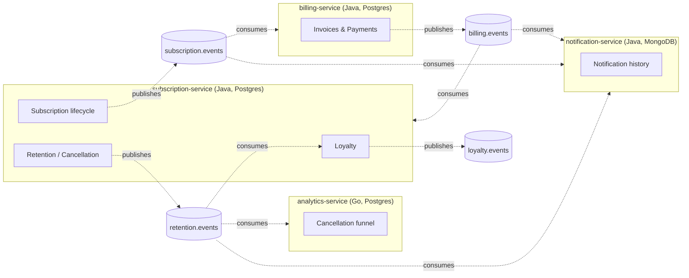

# Sublite Distributed

Тот же домен, что [sublite-core](https://github.com/david-arutyunyan/sublite-core)
(подписки, биллинг, retention/cancellation flow, лояльность), разрезанный на
сервисы через Kafka. Цель проекта — закрыть пробел с брокерами сообщений и
Kubernetes: Transactional Outbox, идемпотентные консьюмеры, Saga (хореография)
с компенсацией, Resilience4j (circuit breaker, retry, DLQ), Kafka в KRaft,
Kubernetes-манифесты под kind, Prometheus/Grafana, OpenTelemetry/Jaeger.

Обоснование границ сервисов и полная схема событий — [docs/architecture.md](docs/architecture.md).

## Архитектура



Каждый прямоугольник — Kafka-топик, каждая пунктирная стрелка — publish
или consume. Топик называется по домену **издателя**, не потребителя —
почему это важно и как это удерживает сервисы слабо связанными подробно
разобрано в `docs/architecture.md`, там же — сиквенс-диаграммы сквозного
сценария покупки (Outbox) и саги отмены с компенсацией, плюс диаграмма
Ingress/HPA-топологии в Kubernetes.

## Сервисы

| Сервис | Стек | Статус |
|---|---|---|
| subscription-service | Java 21, Spring Boot 4, Postgres | покупка + отмена (saga) + Outbox + идемпотентный консьюмер billing.events |
| billing-service | Java 21, Spring Boot 4, Postgres | списание + возврат (saga) + Outbox + идемпотентный консьюмер subscription.events + Resilience4j вокруг PaymentGateway |
| notification-service | Java 21, Spring Boot 4, MongoDB | история уведомлений, идемпотентные консьюмеры обоих топиков |
| analytics-service | Go, Postgres | не начат (опционально) |

## Быстрый старт

```bash
docker compose up -d --build
```

Поднимает Kafka (KRaft, один брокер) + создаёт топики из
`docs/architecture.md` + [Kafka UI](http://localhost:8090) для просмотра
топиков/партиций/сообщений + subscription-service (`localhost:8081`),
billing-service (`localhost:8082`) и notification-service (`localhost:8083`) —
первые два со своим Postgres, последний со своим MongoDB — плюс
[Prometheus](http://localhost:9090), [Grafana](http://localhost:3000)
(анонимный доступ, дашборд открывается сразу) и [Jaeger](http://localhost:16686)
(трейсинг).

```bash
docker compose ps
docker compose logs kafka-init          # список созданных топиков
docker compose logs subscription-service -f
docker compose logs billing-service -f
docker compose logs notification-service -f
```

Купить подписку (два демо-плана уже засеяны — `docs/architecture.md`
не покрывает каталог, коды и id смотри в
`subscription-service/src/main/resources/db/migration/V4__seed_plans.sql`):

```bash
curl -X POST http://localhost:8081/subscriptions \
  -H "Content-Type: application/json" \
  -d '{"customerId":"11111111-2222-3333-4444-555555555555","planPriceId":"33333333-3333-3333-3333-333333333333"}'
```

Ответ — `status: PENDING_PAYMENT`. Списание асинхронное: subscription-service
публикует `SubscriptionCreated` в `subscription.events` (ключ — `subscriptionId`),
billing-service его подхватывает, списывает через `RandomPaymentGateway`
(20% деклайнов — намеренно, чтобы был виден и happy path, и grace period) и
публикует `PaymentSucceeded`/`PaymentFailed` в `billing.events`; subscription-service
подхватывает это и переводит подписку в `ACTIVE` либо `GRACE_PERIOD` — обычно
в пределах пары секунд. GET-эндпоинта пока нет, проверить статус можно так:

```bash
docker exec sublite-distributed-subscription-postgres-1 psql -U subscription -d subscription \
  -c "select id, status from subscriptions;"
```

Смотреть события — либо в Kafka UI, либо:

```bash
docker exec sublite-kafka /opt/kafka/bin/kafka-console-consumer.sh \
  --bootstrap-server localhost:9092 --topic subscription.events \
  --property print.key=true --from-beginning

docker exec sublite-kafka /opt/kafka/bin/kafka-console-consumer.sh \
  --bootstrap-server localhost:9092 --topic billing.events \
  --property print.key=true --from-beginning
```

История уведомлений (записана notification-service по тем же двум событиям
— welcome при создании, плюс исход оплаты):

```bash
curl http://localhost:8083/notifications/11111111-2222-3333-4444-555555555555
```

Retry + DLQ: битое сообщение (не JSON, битый UUID, отсутствует поле) уходит
в `<topic>.DLQ` сразу; временный сбой (БД недоступна, платёжный шлюз бросил
исключение) — после нескольких попыток с экспоненциальным backoff. Живая
проверка:

```bash
docker exec -it sublite-kafka /opt/kafka/bin/kafka-console-producer.sh \
  --bootstrap-server localhost:9092 --topic subscription.events \
  --property "parse.key=true" --property "key.separator=:"
# ввести: some-key:this is not JSON at all

docker exec sublite-kafka /opt/kafka/bin/kafka-console-consumer.sh \
  --bootstrap-server localhost:9092 --topic subscription.events.DLQ \
  --property print.key=true --from-beginning
```

Replay (ручной, по запросу — не автоцикл, см. `docs/architecture.md`):

```bash
curl -X POST http://localhost:8082/admin/dlq/subscription.events/replay
```

Отмена подписки — saga с реальной компенсацией (подробности и диаграмма
потока в `docs/architecture.md`). Работает только для `ACTIVE` подписки:

```bash
curl -X POST http://localhost:8081/subscriptions/<id>/cancel
```

Асинхронно: `CANCEL_PENDING` → billing-service пробует вернуть деньги
(`RandomPaymentGateway`, те же 20% деклайнов) → `CANCELLED` при успехе,
либо КОМПЕНСАЦИЯ обратно в `ACTIVE` при неудачном возврате — подписка не
остаётся отменённой, если деньги вернуть не удалось.

`PaymentGateway` в billing-service дополнительно обёрнут в Resilience4j
(circuit breaker + retry + timeout, `docs/architecture.md`) — 10% вызовов
`RandomPaymentGateway` теперь симулируют технический сбой шлюза (отдельно
от 20% обычных деклайнов), которые retry гасит незаметно для сообщения в
Kafka. Видно в логах:

```bash
docker compose logs billing-service | grep -i "payment gateway"
```

Дашборд Grafana (`grafana/dashboards/sublite-overview.json`, автопровижининг
— открывается сразу с реальными данными): [localhost:3000/d/sublite-overview](http://localhost:3000/d/sublite-overview).
Бизнес-события (покупки, исходы списаний/возвратов, исходы отмен),
resilience (retry/circuit breaker), системное здоровье (HTTP, JVM) —
подробности в `docs/architecture.md`.

Распределённый трейсинг (OpenTelemetry Java agent + Jaeger, без единой
строчки кода в самих сервисах — детали и разбор двух реальных гоч в
`docs/architecture.md`): купи подписку выше, затем открой
[localhost:16686](http://localhost:16686) → Search → service
`subscription-service` → найди `OutboxPoller.publishPending` — один
trace ID пройдёт через subscription-service → Kafka → billing-service →
Kafka → subscription-service/notification-service одним деревом спанов,
включая сам SQL внутри каждого сервиса.

## Kubernetes (kind)

Тот же стек (ядро — Kafka, обе Postgres, Mongo, три сервиса; без
observability-стека, тот остаётся docker-compose-only) как Namespace/
ConfigMap/Secret/Deployment/Service/Ingress/HPA + пробы — полная
инструкция и разбор пяти реальных проблем (прокси в `kind`, multi-arch
image load, deadlock самоссылающегося Kafka, таймауты проб, JVM-старт
дольше окна liveness-пробы) в [`k8s/README.md`](k8s/README.md). Коротко:

```bash
docker compose build subscription-service billing-service notification-service
kind create cluster --config kind-config.yaml
kind load docker-image sublite-distributed-subscription-service:latest \
  sublite-distributed-billing-service:latest \
  sublite-distributed-notification-service:latest --name sublite
kubectl apply -f k8s/00-namespace.yaml -f k8s/01-kafka.yaml -f k8s/02-kafka-init-job.yaml \
  -f k8s/03-subscription-postgres.yaml -f k8s/04-billing-postgres.yaml -f k8s/05-notification-mongo.yaml \
  -f k8s/06-subscription-service.yaml -f k8s/07-billing-service.yaml -f k8s/08-notification-service.yaml
kubectl apply -f https://raw.githubusercontent.com/kubernetes/ingress-nginx/controller-v1.11.3/deploy/static/provider/kind/deploy.yaml
kubectl apply -f https://github.com/kubernetes-sigs/metrics-server/releases/latest/download/components.yaml
kubectl patch deployment metrics-server -n kube-system --type='json' \
  -p='[{"op":"add","path":"/spec/template/spec/containers/0/args/-","value":"--kubelet-insecure-tls"}]'
kubectl apply -f k8s/09-ingress.yaml -f k8s/10-hpa.yaml
curl -X POST http://localhost/subscription-service/subscriptions \
  -H "Content-Type: application/json" \
  -d '{"customerId":"11111111-2222-3333-4444-555555555555","planPriceId":"33333333-3333-3333-3333-333333333333"}'
kubectl get hpa -n sublite
```

## Что демонстрирует проект

| Паттерн | Где | Живая проверка |
|---|---|---|
| Transactional Outbox | `OutboxPoller`, subscription-service и billing-service | HTTP-ответ уходит раньше, чем событие в Kafka — видно в трейсинге (два разных trace root) |
| Идемпотентные консьюмеры | `processed_messages` (Postgres) / `_id`-дедуп (MongoDB) | реальное сообщение перевыпущено байт-в-байт с тем же `eventId` — второй раз пропущено |
| Retry + DLQ + ручной replay | `DefaultErrorHandler` + `DeadLetterPublishingRecoverer` на всех консьюмерах | битое сообщение отправлено вручную через `kafka-console-producer` — ушло в `.DLQ`, реплеено через `/admin/dlq/{topic}/replay` |
| Saga с компенсацией | choreography subscription-service ↔ billing-service | неудачный возврат отменяет CANCEL_PENDING обратно в ACTIVE, а не оставляет подписку в подвешенном статусе |
| Resilience4j | `ResilientPaymentGateway` в billing-service | 20 покупок подряд — retry гасит технические сбои платёжного шлюза, ни одно сообщение не попало в DLQ |
| Метрики + дашборд | Prometheus + Grafana, `spring.kafka.*.observation-enabled` | [localhost:3000/d/sublite-overview](http://localhost:3000/d/sublite-overview) — бизнес-события, resilience, системное здоровье |
| Распределённый трейсинг | OpenTelemetry Java agent + Jaeger, без единой строчки кода в сервисах | один trace ID проходит через 3 сервиса и Kafka одним деревом спанов |
| Kubernetes | Namespace/ConfigMap/Secret/Deployment/Service/Ingress/HPA под kind | HPA сам поймал реальный CPU-всплеск и отмасштабировал subscription-service 1 → 4 без синтетической нагрузки |

## План

1. ~~Границы сервисов и схема событий~~ — [docs/architecture.md](docs/architecture.md)
2. ~~Kafka в Compose, топики~~
3. ~~Transactional Outbox (поллер) в subscription-service~~
4. ~~Вынос billing-service, консьюмер SubscriptionCreated~~
5. ~~Идемпотентные консьюмеры (processed_messages), notification-service~~
6. ~~DLQ + retry + replay на реальных consumer'ах~~
7. ~~Saga с компенсацией на сценарий отмены подписки~~
8. ~~Resilience4j: circuit breaker, retry, таймауты~~
9-10a. ~~Prometheus + Grafana~~
9-10b. ~~OpenTelemetry + Jaeger~~
11a. ~~Kubernetes-манифесты под kind (ядро системы)~~
11b. ~~Ingress + HPA под kind~~
12. ~~README и диаграммы~~ — этот шаг
