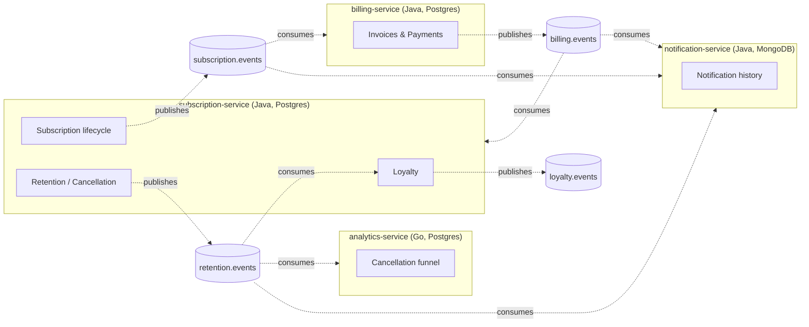

# Архитектура: границы сервисов и схема событий

Разрез монолита [sublite-core](https://github.com/david-arutyunyan/sublite-core)
на события через Kafka. Домен тот же (подписки, биллинг, retention/cancellation
flow, лояльность) — здесь фиксируется, как он делится на сервисы и какие
события между ними ходят. `billing` в монолите специально держит
`invoice.subscription_id` без FK (см. миграцию V11) — уже тогда закладывался
будущий вынос в отдельный сервис.

## Границы сервисов

| Сервис | Владеет | Почему отдельно |
|---|---|---|
| **subscription-service** (Java 21, Spring Boot 4, Postgres) | Plan/PlanPrice, Subscription + state machine, Retention/Cancellation flow, Loyalty | Ядро — жизненный цикл подписки и всё, что напрямую от него зависит |
| **billing-service** (Java 21, Spring Boot 4, Postgres) | Invoice, PaymentAttempt, платёжный шлюз | Другой профиль надёжности (внешний провайдер — медленно, нестабильно, нужен circuit breaker) и другой профиль чувствительности данных. Уже анонсировано в монолите как кандидат на вынос |
| **notification-service** (Java 21, Spring Boot 4, MongoDB) | История уведомлений | Неудачная отправка НИКОГДА не должна откатывать бизнес-транзакцию — классический eventually-consistent consumer. MongoDB естественно ложится на слабоструктурированный контент уведомлений |
| **analytics-service** (Go, Postgres, опционально) | Агрегаты воронки отмены | Другой язык — доказывает, что событийный контракт языко-агностичен, а не завязан на Java-сериализацию |

**Loyalty не выделен в отдельный сервис** — маленький контекст, тесно
завязанный на события подписки, без своего независимого жизненного цикла.
Отдельный сервис ради него — лишний сетевой хоп без архитектурной выгоды.

**Retention — отдельный топик, не отдельный сервис.** Логически часть
subscription-service, но события в своём топике `retention.events`, а не в
`subscription.events` — у них разные потребители (analytics-service хочет
только воронку отмены, `SubscriptionCreated` ему не нужен и будет шумом).



## Правило именования топиков

Топик называется по домену **издателя**, не потребителя: `subscription.events`
— факты, которые публикует subscription-service о себе. Отсюда:
subscription-service знает, когда подписка "созрела" для списания (у него
`currentPeriodEnd`), и публикует `SubscriptionRenewalDue` в **свой** топик —
это факт о подписке, а не команда billing-сервису. billing-service слушает
`subscription.events`, ведёт свою локальную проекцию "какие подписки я
биллю" и решает списывать сам. Осознанная альтернатива синхронному вызову
из scheduler'а, который вернул бы тесную связанность.

## Каталог событий

| Топик | Событие | Ключ | Публикует | Слушает |
|---|---|---|---|---|
| `subscription.events` | SubscriptionCreated | subscriptionId | subscription-service | billing-service, notification-service |
| | SubscriptionRenewalDue | subscriptionId | subscription-service | billing-service |
| | SubscriptionRenewed | subscriptionId | subscription-service | notification-service |
| | SubscriptionCancellationRequested | subscriptionId | subscription-service | billing-service |
| | SubscriptionCancelled | subscriptionId | subscription-service | notification-service, analytics-service |
| | SubscriptionCancellationFailed | subscriptionId | subscription-service | notification-service |
| | SubscriptionPaused | subscriptionId | subscription-service | billing-service |
| `retention.events` | CancellationStarted | subscriptionId | subscription-service | analytics-service |
| | RetentionOfferShown | subscriptionId | subscription-service | analytics-service |
| | RetentionOfferAccepted | subscriptionId | subscription-service | loyalty-модуль, analytics-service |
| | RetentionOfferDeclined | subscriptionId | subscription-service | analytics-service |
| | SubscriptionRetained | subscriptionId | subscription-service | notification-service, analytics-service |
| `billing.events` | PaymentSucceeded | subscriptionId | billing-service | subscription-service, notification-service |
| | PaymentFailed | subscriptionId | billing-service | subscription-service, notification-service |
| | RefundIssued / RefundFailed | subscriptionId | billing-service | subscription-service |
| `loyalty.events` | LoyaltyPointsAwarded / AwardFailed | **customerId** | subscription-service (loyalty-модуль) | notification-service |
| `notification.events` | NotificationSent / NotificationFailed | customerId | notification-service | (саге/DLQ-наблюдаемость) |

Каждый топик из этой таблицы имеет DLQ-двойник (`<topic>.DLQ`) — созданы
заранее в `kafka/create-topics.sh`, retry+DLQ на реальных consumer'ах —
шаг 6, сделано.

На сегодня в коде реализовано и реально публикуется семь событий:
`SubscriptionCreated`, `PaymentSucceeded`, `PaymentFailed` (шаг 3-4),
`SubscriptionCancellationRequested`, `SubscriptionCancelled`,
`SubscriptionCancellationFailed`, `RefundIssued`/`RefundFailed` (шаг 7,
сага отмены — раздел ниже). Остальные строки таблицы фиксируют целевую
форму системы, но publisher'ов для них пока нет.

`SubscriptionCancelled` в этой таблице — переосмысление того, что было
записано на шаге 1: тогда его consumer'ом числился и billing-service, что
имело смысл только пока не было ясно, ЧТО именно должно триггерить возврат
денег. При реальном проектировании саги (шаг 7) стало очевидно: событие с
именем "уже отменено" не может быть тем, что ЗАПУСКАЕТ попытку возврата —
это факт о завершившемся исходе, а не команда попробовать. Отсюда
`SubscriptionCancellationRequested` — то, что реально стартует сагу и то,
что слушает billing-service; `SubscriptionCancelled` теперь публикуется
ТОЛЬКО когда возврат подтверждён, то есть уже после того как всё удалось.
Ранняя схема была наброском, а не контрактом, который нельзя менять —
нормальная часть проектирования, а не ошибка, которую стоит прятать.

## Ключ сообщения

Kafka гарантирует порядок только внутри одной партиции (`hash(key) %
numPartitions`), никогда — внутри топика целиком. Без ключа — round-robin,
порядка нет вообще.

- **subscriptionId** для subscription/retention/billing-событий: consumer,
  обрабатывающий жизненный цикл одной подписки, обязан видеть
  `SubscriptionCreated` раньше `SubscriptionCancelled` для неё же.
- **customerId** для loyalty/notification: баланс баллов и история
  уведомлений — ресурс уровня клиента, не подписки.

Consistent-ключевание НЕ гарантирует межтопиковый порядок — это два
независимых потока, даже если ключ один и тот же. Если порядок между
`subscription.events` и `billing.events` важен — это забота consumer-логики
(проверка состояния перед применением события), а не брокера.

## Consumer groups

Каждый сервис, независимо потребляющий топик, — свой `group.id`. Общий
`group.id` у двух сервисов означает, что Kafka поделит партиции между ними
(каждый увидит только часть потока) — почти никогда не то, что нужно для
независимых сервисов. Когда один сервис масштабируется на несколько
инстансов (HPA, шаг 11) — все его поды используют один и тот же `group.id`,
и вот тогда партиции делятся между ними осознанно.

## Конверт события

Без Schema Registry/Avro на старте — осознанное упрощение, эволюция схем
отдельная тема, если понадобится позже.

```json
{
  "eventId": "0f3a...-uuid",
  "eventType": "SubscriptionCancelled",
  "aggregateId": "subscriptionId-uuid",
  "occurredAt": "2026-09-05T10:00:00Z",
  "correlationId": "request-scope-uuid",
  "payload": { "...": "событие-специфичные поля" }
}
```

`eventId` — ключ дедупликации на стороне consumer'а (`processed_messages`
таблица с уникальным индексом, проверяется перед обработкой). `correlationId`
— продолжение `CorrelationIdFilter` из sublite-core: связывает цепочку
событий через несколько сервисов в рамках одной саги.

## Партиции и гарантии доставки

3 партиции на топик — достаточно, чтобы увидеть параллелизм и ребалансировку
локально, без переинженеринга под нагрузку, которой в pet-проекте не будет.

At-least-once + идемпотентный consumer, не exactly-once. Kafka Transactions
дают EOS только строго внутри Kafka или Kafka→одна БД через outbox — не
через границу независимых сервисов с раздельными БД. Промышленный паттерн —
не бороться за EOS, а сделать side-effect идемпотентным через дедуп-таблицу.

## Идемпотентные consumer'ы (шаг 5, сделано)

`subscription-service` и `billing-service` — каждый со своей таблицей
`processed_messages` (`event_id UUID PRIMARY KEY`). Проверка "уже
обработано?" и запись в эту таблицу происходят в ОДНОЙ локальной
`@Transactional`-транзакции с самим side-effect'ом (списание, смена
статуса подписки) — падение между "сделали" и "записали, что сделали"
невозможно: либо оба произошли, либо ни один, повторная доставка в любом
случае безопасна.

`notification-service` (MongoDB) — та же гарантия, другой механизм:
у документа `Notification` `_id` — это сам `eventId`, и `insert()` (не
`save()` — тот делает upsert и молча перезапишет документ) кидает
`DuplicateKeyException` на повторе. Естественная уникальность `_id` вместо
отдельной дедуп-таблицы — там, где единственный side-effect и есть сама
запись, а не что-то, что нужно защищать отдельно.

Проверено не вызовом метода дважды, а настоящей передоставкой: захвачено
реальное сообщение `SubscriptionCreated` с боевого топика и опубликовано
повторно байт-в-байт (тот же `eventId`) — `billing-service` залогировал
skip и не создал второй Invoice.

`notification-service` также держит `subscription_projections` — локальную
проекцию `subscriptionId -> customerId`, построенную из `SubscriptionCreated`
(не синхронный запрос в subscription-service — database-per-service такое
не позволяет, да и не должен). `billing.events` не несёт customerId
(billing-service тоже не владеет данными клиента), поэтому уведомление по
оплате достаёт customerId из этой проекции. Живая проверка вскрыла реальный
гоч: у свежего consumer group'а с `auto.offset.reset=earliest` при первом
старте (или после большого бэклога) `billing.events` и `subscription.events`
догоняются НЕЗАВИСИМО — нет гарантии, что проекция из одного топика успеет
собраться раньше, чем событие из другого топика её потребует. Раз
случилось на реальном стеке: уведомление об оплате пришло раньше, чем
`SubscriptionCreated` для той же подписки успел построить проекцию.
Обработано явным fallback (customerId = "unknown" + warning в лог), а не
падением или потерей уведомления.

## Retry + DLQ (шаг 6, сделано)

Все три сервиса: `DefaultErrorHandler` (Spring Kafka) вместо тишины по
умолчанию — без него неудачное сообщение молча ретраится 10 раз с нулевым
интервалом и затем ПРОПАДАЕТ (лог есть, следа в Kafka — нет). Два класса
ошибок, разная реакция:

- **Poison pill** (`JsonProcessingException` — не JSON вообще,
  `IllegalArgumentException` — битый UUID, `NullPointerException` —
  отсутствует обязательное поле конверта) — ретраить бессмысленно, данные
  не изменятся. Сразу в DLQ.
- **Всё остальное** (недоступна БД, платёжный шлюз бросил исключение вместо
  `Declined`) — экспоненциальный backoff (`sublite.kafka.retry.*`,
  по умолчанию 4 попытки, 500мс → 5с), и только после исчерпания — в DLQ.

`DeadLetterPublishingRecoverer` публикует в `<topic>.DLQ` (партиция та же,
что у оригинала) — это и есть механизм, который реально снимает грабли #3
ниже: без recoverer'а `DefaultErrorHandler` после исчерпания попыток просто
логирует и пропускает запись, оставляя офсет закоммиченным — сообщение
физически исчезает, DLQ-топик тут ни при чём, если его никто не публикует.

**Реальный гоч, не описанный заранее**: `subscription.events` слушают ДВА
сервиса (billing-service, notification-service) с независимыми
consumer group'ами. Один и тот же "битый" месседж независимо проваливается
у каждого — и каждый публикует СВОЮ копию в один и тот же
`subscription.events.DLQ`. Топик группируется по топику-источнику, не по
паре (топик, consumer group) — на практике это значит, что DLQ может
содержать N копий одного сообщения, где N — число сервисов, слушающих этот
топик. Не исправлено (пер-consumer'ный DLQ топик — over-engineering для
масштаба этого проекта), но задокументировано, чтобы не удивлять при
живом дебаге.

**Replay** — `POST /admin/dlq/{topic}/replay` на каждом сервисе
(`DlqReplayService`): ручной, по запросу оператора, не автоматический цикл
"словил — тут же переиграл" (та ошибка, что заDLQ'ила сообщение, скорее
всего ещё жива секунду спустя). Критичная деталь реализации: снимок
end-offset'ов топика ДО чтения, а не "читаем пока не кончится" — иначе,
если переигранное сообщение всё ещё сломано, оно тут же проваливается у
живых consumer'ов и падает обратно в тот же DLQ-топик, который replay всё
ещё читает: `poll()`, видящий свежие записи от собственного побочного
эффекта, зацикливается без остановки. Ровно так и произошло при живой
проверке этого шага — один намеренно "ядовитый" месседж превратился в
сотни записей в DLQ за секунды, прежде чем это было замечено и
пофикшено снимком офсетов.

## Saga: отмена подписки (шаг 7, сделано)

Хореография, не оркестрация — нет центрального координатора саги, каждый
сервис реагирует на события и публикует свои. С РЕАЛЬНОЙ компенсирующей
транзакцией, не просто цепочкой событий в одну сторону:

```
POST /subscriptions/{id}/cancel
  subscription-service: ACTIVE -> CANCEL_PENDING
  публикует SubscriptionCancellationRequested
      |
      v
billing-service слушает, пробует вернуть деньги через PaymentGateway.refund()
  публикует RefundIssued ИЛИ RefundFailed
      |
      v
subscription-service слушает:
  RefundIssued  -> CANCEL_PENDING -> CANCELLED (прямой путь завершён)
  RefundFailed  -> CANCEL_PENDING -> ACTIVE    (КОМПЕНСАЦИЯ: откат)
```

`CANCEL_PENDING` — статус саги "в полёте", та же роль, что `PENDING_PAYMENT`
у покупки: подписка сидит здесь между "клиент попросил отменить" и
"billing-service подтвердил возврат". Возврат — по полной цене плана, без
проценки по остатку периода — намеренное упрощение (математика проценки
отвлекает от самого паттерна saga/компенсация, который здесь в фокусе).

**Компенсация в деталях**: `requestCancellation()` — оптимистичный переход,
сделанный ДО того как известно, получится ли возврат. Если billing-service
отвечает `RefundFailed`, `abortCancellation()` откатывает ровно то, что
сделал `requestCancellation()` — CANCEL_PENDING обратно в ACTIVE. Без этого
подписка застряла бы в CANCEL_PENDING навсегда: не активна для клиента, но
и не отменена по-настоящему (деньги не вернулись).

**HTTP-триггер ведёт себя иначе, чем Kafka-триггер, и это осознанно**:
`requestCancellation()` (вызывается синхронно из контроллера) БРОСАЕТ
исключение при недопустимом переходе → 409 клиенту. `confirmCancellation()`
и `abortCancellation()` (вызываются из Kafka-listener'а) молча не делают
ничего в недопустимом состоянии — та же redelivery-safe форма, что у
`activate()`/`enterGracePeriod()` с шага 4. HTTP-клиент должен увидеть
ошибку на невалидный запрос; Kafka-consumer обязан пережить повторную
доставку без ошибки.

**Реальный баг, пойманный вживую, не тестами**: `confirmCancellation()`/
`abortCancellation()` на сущности `Subscription` возвращали `void` —
guard внутри них молча не менял состояние при недопустимом переходе, но
слой сервиса (`CancellationService`) публиковал исходящее событие и писал
"успех" в лог БЕЗУСЛОВНО, не проверяя, действительно ли переход произошёл.
Поймано гонкой на живом стеке: вручную опубликованное `RefundFailed` и
настоящий (более медленный, идёт через два цикла outbox-поллера) ответ
billing-service пришли для одной саги с РАЗНЫМИ `eventId` — дедуп по
`eventId` корректно пропустил оба (это не redelivery одного и того же
сообщения, а два разных события), но БЕЗ проверки результата перехода
второе сообщение всё равно опубликовало ВТОРОЙ `SubscriptionCancellationFailed`
и залогировало вторую "компенсацию", хотя сущность на этот раз осталась
без изменений (уже ACTIVE). Исправлено: `activate()`, `enterGracePeriod()`,
`confirmCancellation()`, `abortCancellation()` теперь возвращают `boolean` —
сервисный слой публикует событие и логирует успех, только если переход
РЕАЛЬНО произошёл. Регрессия закрыта тестом
(`aSecondConflictingRefundFailedDoesNotRepublishTheCompensation`) и
повторно проверена на живом стеке — тот же сценарий гонки после фикса
корректно логирует "Ignoring RefundFailed - subscription not in
CANCEL_PENDING" вместо повторной компенсации.

## Resilience4j (шаг 8, сделано)

Circuit breaker + retry + timeout вокруг `PaymentGateway` в billing-service
— единственная в проекте зависимость, реально похожая на внешний сервис.
subscription-service и notification-service такой зависимости не имеют
(только своя БД и Kafka, у которых уже есть собственные механизмы
устойчивости) — городить Resilience4j там ради самого факта было бы
искусственно.

**Два разных отказа, разная реакция**. `RandomPaymentGateway` теперь
симулирует ДВЕ независимые оси, не одну:
- **Business decline** (`ChargeResult.Declined`, 20%) — нормальный,
  ожидаемый исход. Ретраить или размыкать цепь на "недостаточно средств"
  бессмысленно — карта не станет платёжеспособной со второй попытки.
- **Технический сбой** (`PaymentGatewayUnavailableException`, 10%) —
  симулирует таймаут/недоступность самого шлюза. Вот на что реально
  реагируют retry/circuit breaker.

`ResilientPaymentGateway` — единственный Spring-бин `PaymentGateway` в
сервисе; `RandomPaymentGateway` теперь просто объект, который он
оборачивает (не `@Component`). `SubscriptionChargeService` и
`SubscriptionCancellationService` не знают о существовании обёртки —
как звали `gateway.charge()/refund()` через интерфейс, так и зовут.

Порядок композиции (снаружи внутрь): `Retry(CircuitBreaker(TimeLimiter(
call)))` — канонический для Resilience4j. `TimeLimiter` требует
`CompletableFuture`, поэтому сам вызов шлюза уходит в отдельный executor —
но вызывающий поток БЛОКИРУЕТСЯ на результате прежде чем вернуть его,
и именно поэтому вызов безопасен изнутри `@Transactional`-методов: на
фоновом потоке не происходит ничего, кроме самого (чистого, без побочных
эффектов) вызова шлюза — работе с БД неоткуда там взяться.

**Два независимых слоя retry, не один** — важно не спутать:
- `ResilientPaymentGateway`'s Retry (`sublite.resilience.retry.*`) —
  быстрый, ВНУТРИ одной попытки обработки сообщения, ретраит один
  конкретный вызов шлюза (сотни миллисекунд).
- `DefaultErrorHandler`'s retry (`sublite.kafka.retry.*`, шаг 6) —
  медленнее, ретраит ВСЁ сообщение целиком через отдельные циклы poll()
  (секунды), и именно он в итоге кладёт сообщение в DLQ, если сбой
  пережил оба слоя.

Короткий сбой гасится на внутреннем слое, ни разу не потревожив внешний;
настоящий затяжной сбой всё равно доходит до DLQ — не подмена механизма
шага 6, а дополнительный слой перед ним.

Проверено вживую (20 покупок подряд) — retry несколько раз реально
сработал (`Retrying payment gateway call`, видно в логах), ни одно
сообщение не попало в DLQ, все 20 подписок благополучно разрешились.
Circuit breaker живьём не открывался — при вероятности технического сбоя
10% и 3 попытках retry, вероятность исчерпать ВСЕ попытки на одном
сообщении — 0.1³ = 0.1%, слишком редко для надёжной живой демонстрации.
Открытие цепи и fail-fast без обращения к делегату — детерминированно
проверены отдельным unit-тестом (`ResilientPaymentGatewayTest`, без
Spring/Kafka/Postgres — чистая композиция Resilience4j, тестировать это
через реальный брокер было бы избыточно).

## Наблюдаемость: метрики (шаг 9-10a, сделано)

Prometheus + Grafana. Trace'инг (OpenTelemetry + Jaeger) — отдельный
под-шаг, ещё не сделан.

**Kafka-метрики почти бесплатно**: `spring.kafka.template.observation-enabled`
и `spring.kafka.listener.observation-enabled` во всех трёх сервисах —
две строчки конфига, ноль кода, и Spring Kafka сам публикует таймеры
обработки и счётчики ошибок на listener (`spring_kafka_listener_seconds_*`)
через Micrometer Observation API.

**Бизнес-метрики — руками, там, где это реально что-то говорит о системе**,
не généric-инструментация ради самого факта:
- subscription-service: `subscriptions.purchased` (тег `plan`),
  `subscriptions.cancellation.requested`,
  `subscriptions.cancellation.outcome` (тег `outcome`: confirmed/compensated
  — именно этот счётчик показывает сагу шага 7 живьём: сколько отмен
  завершилось нормально против скольких потребовали компенсации).
- billing-service: `charges` (тег `outcome`: succeeded/declined),
  `refunds` (тег `outcome`: issued/failed),
  `payment_gateway.retries`,
  `payment_gateway.circuit_breaker.transitions` (тег `to_state`) — те же
  события, что шаг 8 уже логировал, теперь ещё и на дашборде.
- notification-service: `notifications.recorded` (тег `type`).

Дашборд — `grafana/dashboards/sublite-overview.json`, автопровижининг
(`grafana/provisioning/`) — открывается сразу с реальными данными, без
ручной настройки datasource. Три ряда панелей: бизнес-события,
resilience (retry/circuit breaker), системное здоровье (HTTP, JVM heap).

Живая проверка: 30 покупок + 3 отмены подряд — все панели заполнились
реальными данными, включая `Circuit breaker state transitions` (пусто —
корректно, цепь ни разу не открывалась, см. шаг 8) и
`Cancellation outcomes` (3 confirmed, 0 compensated — все три возврата
прошли).

## Грабли

1. Число партиций топика можно только увеличивать, никогда не уменьшать —
   и увеличение задним числом меняет `hash(key) % N` для новых сообщений.
2. `enable.auto.commit=true` (дефолт) коммитит offset по таймеру независимо
   от успеха обработки — крах между auto-commit и завершением обработки
   теряет сообщение. Нужен manual commit после успешной обработки.
3. "Poison pill": одно неперевариваемое сообщение блокирует всю партицию за
   собой — Kafka не даёт закоммитить offset "через" непрочитанное сообщение.
   **Решено на шаге 6**: retry + DLQ выше — после исчерпания попыток
   `DeadLetterPublishingRecoverer` публикует запись в `<topic>.DLQ` и
   ПОЗВОЛЯЕТ закоммитить исходный offset, освобождая партицию.
4. Idempotent producer (`enable.idempotence=true`) убирает дубли только от
   ретраев самого продюсера — не имеет отношения к дублированию на стороне
   consumer'а при redelivery.
5. Rebalancing storm: consumer, не укладывающийся в `max.poll.interval.ms`
   или часто падающий, останавливает ребалансировкой всю группу (со старым
   eager-ассайнером). `CooperativeStickyAssignor` смягчает это.
6. KRaft, не ZooKeeper — большинство туториалов в интернете всё ещё про
   ZK-based setup, другой набор переменных окружения.
